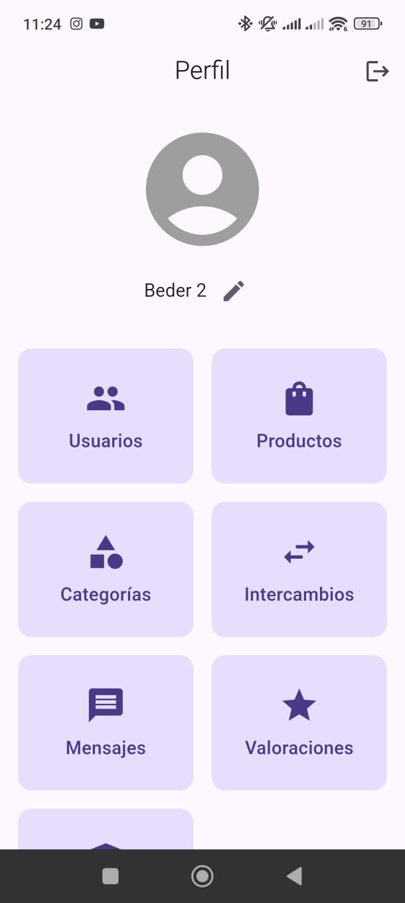

# 🔄 EcoIntercambio - App de Trueque Sostenible



Aplicación móvil para intercambiar productos/servicios de manera sostenible, conectando usuarios con intereses comunes.

## 🌱 Entidades Principales
- **Usuarios**: Perfiles con datos personales e historial.
- **Productos/Servicios**: Items disponibles para intercambio.
- **Categorías**: Alimentos, ropa, reciclaje, etc.
- **Intercambios**: Registro de transacciones completadas.
- **Mensajes**: Chat integrado entre usuarios.
- **Valoraciones**: Sistema de reputación post-intercambio.

## 🛠 Tecnologías
- **Frontend**: Flutter (Dart)
- **Backend**: Firebase
  - Autenticación (Firebase Auth)
  - Base de datos: Firestore
  - Almacenamiento: Firebase Storage

## 📂 Estructura del Proyecto
```plaintext
lib/
 ├── assign_product_screen.dart    # Asignación de productos
 ├── categories_screen.dart       # Gestión de categorías
 ├── exchanges_screen.dart        # Historial de intercambios
 ├── firebase_options.dart        # Configuración de Firebase
 ├── inventory_screen.dart        # Inventario de usuario
 ├── main.dart                    # Punto de entrada (con autenticación)
 ├── messages_screen.dart         # Sistema de mensajería
 ├── products_screen.dart         # Catálogo de productos
 ├── ratings_screen.dart          # Valoraciones
 ├── user_products_screen.dart    # Productos del usuario
 └── users_screen.dart            # Gestión de perfiles